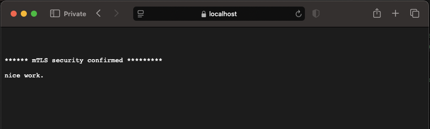

# nginx-configs

NGINX configuration examples for various situations.

## How to Use

- clone this repository
- cd to the folder you want to test
- open the `README` for the example
- follow the example instructions for testing

## Configurations

### mutual-tls (strict) authentication

Protect an nginx route with mutual tls by only allowing requests from valid clients.

  

## Notes / Disclaimers:

- Don't use any example auth / certificates here in the real world for anything! 
    - They're public on Github, they are just for demo / proof of concept

- Examples are not meant to be all-encompassing
    - These are only **one possible implementation** of a specific scenario 
    
- Review NGINX documentation carefully and understand everything before ever depending on any configuration to protect a real-world resource
    - Do not deploy anything here verbatim, instead use as a starter, reference, or working example

Need Help? Please [reach out to us](mailto:hey@gigabitelabs.com) if you need custom implementation, support, deployment advice, etc.

## TODO

Some future examples to add and other project ideas.

Meta-nginx config:

- Implement single nginx config at the root level that includes as many of the example projects as 
possible
- Include a route map with links to the sub-projects for each route

Future Examples:

- Architecture supporting multiple routes in a maintainable / sane way
- Headers
- Caching
- Clustered service node distribution config