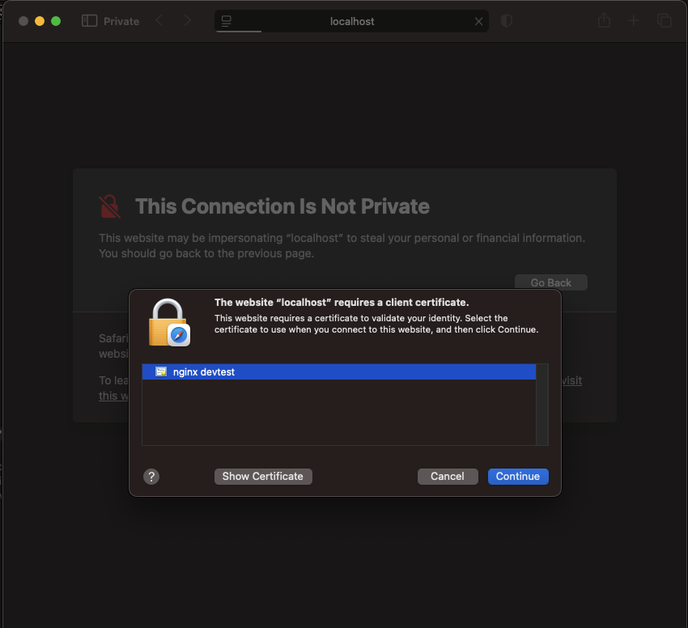
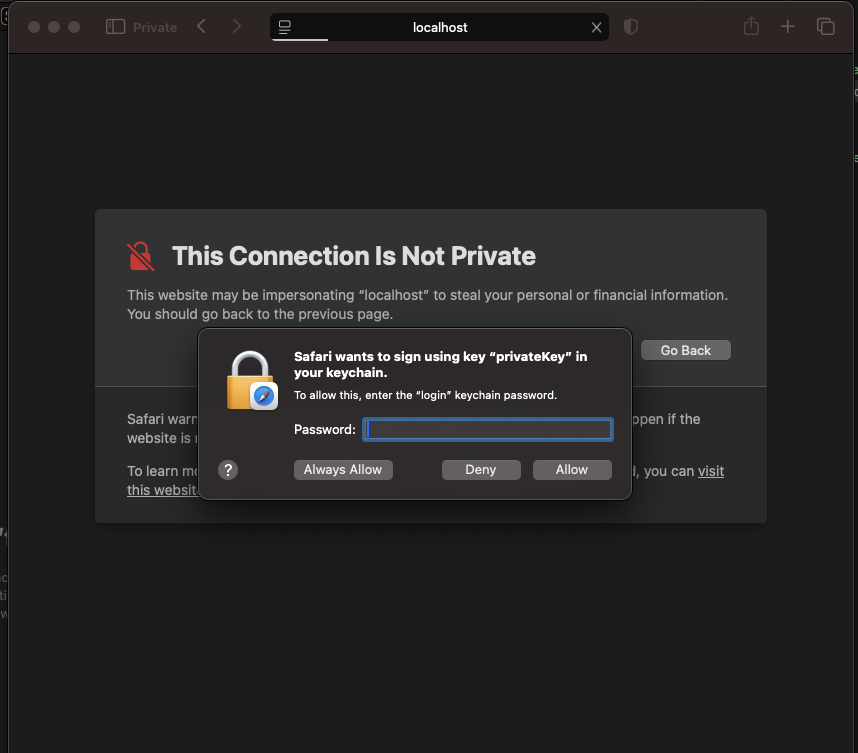

# Mutual-TLS

This implementation demonstrates one approach to strictly protecting an NGINX route with mutual-tls authentication.

Best used for:

- NGINX configurations where every single request must be secured by mutual TLS, without exceptions

- Technical scenarios that don't need gradual back-off or retry strategies for failed auth, like server-to-server auth, or quick and dirty deployments

## Config Details

### HTTPS Required

This example tesls mTLS so the server does not respond to an HTTP request. All requests must be sent to `https://localhost` as a base url etc. (see full testing details below)

### Invalid Traffic is Dropped by Default

- In this configuration, all invalid requests (traffic without valid client certs) are **dropped**, meaning the server will not give an error, it just sends the traffic into the void and disconnects.

    - Not seeing a response means that you have not properly installed the client certificate on your device / browser / client

    - Tip: Don't install the client certificate until you run the container and confirm you cannot access the route without one

## Run the server

Install dependencies:

- docker:
    - install via docker desktop, homebrew (mac), snap (ubuntu), yum (RHEL) etc.

- nginx image:
    - run: `docker pull nginx:latest`

Run Debug Container:

- cd to the root of the `mutual-tls` project
    - e.g.: `cd (repo-path)/NGINX-CONFIGS/mutual-tls`

- run script
    - `bash ./run-docker-debug.sh`

Once the container starts and is attached, you will see the container log stream in your terminal. 

## Test Mutual-TLS Server-Client Config

The example has a server and client mTLS certificates already included to ensure a quick test is possbile of the example. (Don't ever use these for anything other than testing this example).

In this example, the protected route is hosted at: `https://localhost:8006/mtls-strict`

There are two basic scenarios to test:

1) Rejection of requests without a valid client certificate
2) Successful response after installing a valid client certificate

Test them in this order to ensure expected behavior.

### Rejection without Client Certificate

Note: this is for testing **before** you install the client certificate.

#### Test

How to test:

- Open your browser
- navigate to `https://localhost:8006/mtls-strict`

Confirm:

- The server does not respond
- You are not redirected to another site or shown an error html page
- The browser will just show a blank / black screen and report that the server has disconnected 

### Successful Route Access with Client Certificate

#### Install / import the client certificate:

- The client certificate is exported as a .p12 file that is like a package of credentials
    - Find the client .p12 in: `$project_root/mtls/client/nginx-localhost-test-client-client.p12`

- You will need the password to open the .p12
    - The password is: `1234`

- Depending on your setup, you may either need to add the client idenity to the browser or the system. Here are a few scenarios I have tried and confirmed:

    - Safari on iOS / iPadOS
        - AirDrop the .p12 to the device, or open it from files
        - Open `settings` and a banner will direct you to the profile, or you can navigate to `settings> general> VPN & Device Management`
        - Tap on the configuration profile
        - Tap approve / yes for everything
        - When it asks for the password, type:
            - `1234`
        - Confirm / trust anything you need to finish setup
        - Your device will prompt you to confirm the first time you attempt to access
            - After that, Safari will automatically use the certificate in Safari when prompted by the server

    - Safari on macOS
        - Open the client .p12 file:
            - `nginx-localhost-test-client-client.p12`
        - Install on your system and confim any dialogs
        - Used password `1234` when prompted
        - Your device will prompt you to confirm the first time you attempt to access
            - After that, Safari will automatically use the certificate in Safari when prompted by the server

    - Firefox on iOS / iPadOS (unsupported)
        - Unfortunately, mTLS certificates are not really supported on firefox mobile beccause the app doesn't properly interact with the system trust store.
            - This is a known issue and Mozilla suggests that we contribute a solution if we want to fix it. Sorry!

    - Firefox on macOS / Ubuntu
        - Open the browswer 
        - Open settings and search "cert"
        - Click on the certificate panel
        - Click import certificate & select the .p12 file
        - Use password `1234`
        - Your device will prompt you to confirm the first time you attempt to access
            - Subsequent attempts to access will automatically use the certificate

Resources:

- Client confirmation dialog on Safari:

- macOS Keychain authorization:

 

#### Test

How to test:

- Open your browser
- navigate to `https://localhost:8006/mtls-strict`

Confirm:

- You are prompted to confirm your client identity the first time you try to access the protected route
    - The browser prompts you to confirm the identity of the client cert you installed
    - After confirming, the server responds with "mTLS security confirmed"

- Subsequent access is automatic
    - You should not be prompted
    - Test by closing and re-opening, trying a new window, etc

- Opening in a private window causes re-confirmation of client identity

- You are not redirected to another site or shown an error html page

Successful Response:

(woo hoo!)